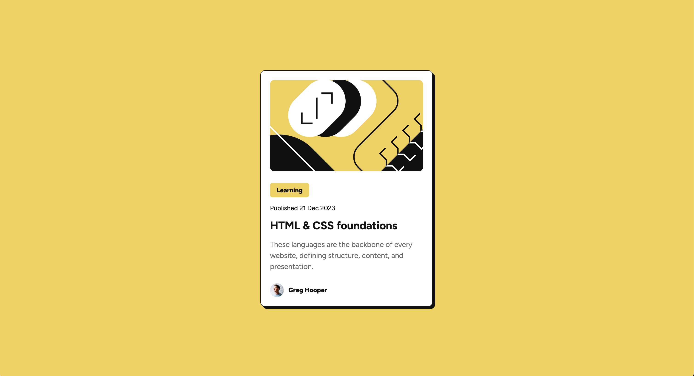

# Frontend Mentor - Blog preview card solution

This is a solution to the [Blog preview card challenge on Frontend Mentor](https://www.frontendmentor.io/challenges/blog-preview-card-ckPaj01IcS). Frontend Mentor challenges help you improve your coding skills by building realistic projects. 

## Table of contents

- [Overview](#overview)
  - [The challenge](#the-challenge)
  - [Screenshot](#screenshot)
  - [Links](#links)
- [My process](#my-process)
  - [Built with](#built-with)
- [Author](#author)

## Overview

### The challenge

Users should be able to:

- See hover and focus states for all interactive elements on the page

### Screenshot

### Links

- Solution URL: [https://github.com/BaileyKH/blog-preview-react](https://github.com/BaileyKH/blog-preview-react)
- Live Site URL: [https://blog-preview-sandy-nu.vercel.app/](https://blog-preview-sandy-nu.vercel.app/)

## My process

### Built with

- JSX
- React
- Tailwind CSS

## Author

- Website - [Bailey Henderson](https://www.baileykh.dev)
- Frontend Mentor - [@BaileyKH](https://www.frontendmentor.io/profile/BaileyKH)
- LinkedIn - [@BaileyKH](www.linkedin.com/in/baileykh)
